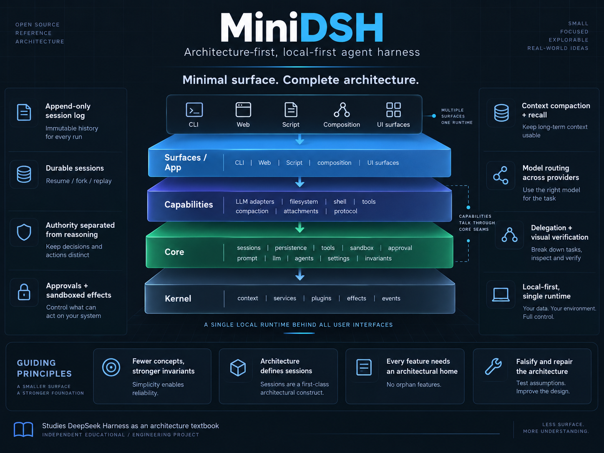

# MiniDSH

[](https://www.npmjs.com/package/minidsh)
[](https://github.com/earthwalker17/MiniDSH/actions/workflows/check.yml)
[](LICENSE)




> **Minimal surface. Complete architecture.**

MiniDSH is a small, local-first coding-agent harness: the runtime around a model that gives it tools, sessions and permissions. Install it, point it at a repository, and use it from a terminal, a browser or a script. It is also a reference architecture small enough to read in a sitting, and an experiment in growing an AI-assisted system *architecture-first* rather than feature by feature.

It studies [DeepSeek Harness](https://github.com/deepseek-ai/deepseek-harness) (DSH) — DeepSeek's open-source, plugin-composed and unusually well documented coding agent — as a textbook, and asks how small a system can be while keeping the same architectural properties. It is an independent educational and engineering project: not a fork, not a product, and not affiliated with or endorsed by DeepSeek.

---

**Contents:** [What it is](#what-minidsh-is) · [Quick start](#quick-start) · [What you get](#what-you-get) · [Status and limitations](#status-and-limitations) · [The question it investigates](#the-question-it-investigates) · [Architecture](#architecture) · [What it learned from DeepSeek Harness](#what-minidsh-learned-from-deepseek-harness) · [The architecture-first experiment](#the-architecture-first-experiment) · [Verification](#verification) · [Documents and help](#documents-and-help) · [License](#license-and-attribution)

---

## What MiniDSH is

Three things:

1. **Useful software.** A coding agent that edits files and runs commands under an authority you set — which files it may write, and which actions need your approval — and can audit afterwards; that survives its process being killed and can be resumed or forked from its log; that manages its own context; that can hand a bounded task to a child or, with a vision plugin inserted, a visual check to a model that can see. Two providers ship (DeepSeek and Anthropic), and a session can switch models mid-conversation.
2. **A reference architecture.** About twenty thousand lines of TypeScript in one package with one runtime dependency: four layers with a dependency rule enforced by a script in `pnpm check`, seventeen service contracts in core plus one in the application, each with stated ownership, twenty-seven durable event kinds, and one document — [`ARCHITECTURE.md`](docs/ARCHITECTURE.md) — that says where every new thing goes.
3. **A systems-engineering experiment.** Whether a project built almost entirely by coding-agent sessions can keep a global architecture intact across months, by making it explicit, inspectable and continuously falsified rather than letting sessions gradually invent it.

The thesis is **fewer concepts and stronger invariants**, not fewer lines or more features.

## Quick start

Requirements:

- **Node 24** or newer.
- **Windows:** PowerShell 7 (`pwsh`). The shell tool runs `pwsh` only and refuses loudly, naming the remedy, when it is missing; it never falls back to PowerShell 5.1. Windows has no shell-confinement backend, so every shell command there costs one approval (see below).
- **Linux:** `bubblewrap` (`apt install bubblewrap`) if you want shell commands confined by the operating system instead of approved one by one. **macOS** needs nothing extra.
- **A provider key:** `DEEPSEEK_API_KEY` for the default provider, `ANTHROPIC_API_KEY` for Anthropic — in the environment, or in `~/.minidsh/credentials.json` as `{"DEEPSEEK_API_KEY": "…"}`. Only a key's *name* is ever logged; a run without one stops and names the key it expected.

```sh
npm install -g minidsh            # or run it without installing: npx minidsh …

minidsh chat --cwd path/to/repo   # interactive terminal (--cwd defaults to the current directory)
minidsh web  --cwd path/to/repo   # the same runtime in a browser; open the one URL it prints
minidsh run "fix the failing test in src/slug.test.mjs" --approve
                                  # --approve answers every approval yes; without it a headless run
                                  # refuses anything that needs one — on Windows, that is every shell command
minidsh run "review this module for unchecked inputs" --provider anthropic --model claude-sonnet-5
minidsh run "summarize this repository" --json     # one JSON line per session event on stdout

minidsh sessions list                     # what is stored, by name
minidsh sessions show <id> --audit        # what this session was allowed to do, and when
minidsh resume <id> "continue"            # pick a stored session up; fork <id> --at <seq> branches it at an event number
minidsh config                            # the effective plugin composition, and which file set each entry
minidsh --help
```

In the terminal: `y`/`N` answers an approval; `/sandbox <read-only|workspace-write|danger-full-access>`, `/ask <ask|never>` and `/preset <name>` switch authority; `/model [<provider>/]<model> [effort]` switches the model; `/compact` shrinks context; `/history` pages back; `/sessions` lists recent sessions (`minidsh sessions list` has all of them); `/cancel` stops the running turn; `/exit` quits. Typing while a turn is running steers it.

Everything MiniDSH keeps lives under `~/.minidsh` (override with `MINIDSH_HOME`): `sessions/` (one JSONL log per session), `spill/` (oversized tool output, swept after 30 days), `attachments/` (images, never swept), `composition.json`, `settings.json` (the one file the runtime also writes, via the settings method on the wire), `credentials.json`, and an optional `AGENTS.md` that every session reads. A session is stored the moment it records its first prompt; nothing in the harness deletes a log.

From a checkout: `pnpm install`, then `pnpm minidsh …` (TypeScript runs natively on Node 24, so there is no build step to run it; `pnpm build` only emits the `dist/` the tarball ships) and `pnpm check` for the whole verification suite. See [`CONTRIBUTING.md`](CONTRIBUTING.md), and read [Status and limitations](#status-and-limitations) before relying on it.

## What you get

**Authority you set, and a record you can read back.** A run defaults to `workspace-write` with approvals `ask`: file writes are restricted to the working directory, reads are unrestricted, and shell commands are confined by the operating system where it can (bubblewrap on Linux, Seatbelt on macOS; the harness probes that the backend works before claiming it). On a confined host an ordinary task costs nobody a decision. The modes are `read-only`, `workspace-write` and `danger-full-access`, which drops confinement for the whole session; the first approval prompt says so. Approvals are answered in the terminal, in the browser, or by `--approve` on a headless run. Every session records the authority it starts under and every later switch, request and decision; `sessions show --audit` prints that history back. What confinement does not cover is in [Status and limitations](#status-and-limitations).

**Sessions that survive their process.** Everything the model was shown and did is one append-only JSONL log. Kill the process mid-turn and the next `resume` repairs the tail and continues under the authority the log recorded; `fork <id> --at <seq>` branches a session at any event. A second process cannot resume a session another one holds: a lease refuses it before a byte is appended. Because the model's history is derived from the log, a stored log can be replayed without an API key, as a test of the session that wrote it.

**Context that manages itself.** A meter over the log tracks pressure (the terminal shows `[ctx 34% · 12.4k/32k]`). Near the model's window, or when the provider refuses a request as too large, the oldest history is replaced by a summary (*compaction*); the summarized events stay in the log, and the model can read them back with `history_read` within a token budget. Oversized tool output is spilled to disk with an excerpt and a path. An `AGENTS.md` (or `CLAUDE.md`) in the workspace enters as instructions to the model, never permissions for the harness.

**Switch models mid-conversation.** The route — provider, model, reasoning effort — is a durable fact a session can change at any point (`--provider`/`--model`, `/model anthropic/claude-sonnet-5`, or `session/model` over the protocol), and the log records it. A `model-roles` entry in `composition.json` maps a *purpose* — the compaction summary, a delegated child — to a different route. The DeepSeek adapter ships `deepseek-v4-flash` (the default), `deepseek-v4-pro` and a vision model; the Anthropic adapter ships the Claude 5 and 4 families with per-model facts measured against the live API. An option a provider cannot honour is refused, never silently dropped.

**Delegation with a ceiling.** The model can hand one bounded task to a `subagent`: a child with its own session and log whose authority is fixed at its parent's or narrower and cannot be widened from inside; approvals are off, so an action needing one is refused. A verifier that can *see* is a second `subagent` entry pointed at a vision model, using the `view_image` tool — a built-in plugin that is off by default and enabled from `composition.json`.

**Composition from disk.** The default composition is a list of thirty-five plugin entries (*rows*); `~/.minidsh/composition.json` and `--patch` files override it, and each row remembers which file changed it. A row can be disabled, reconfigured or replaced by module specifier; every session records the composition it ran under; `minidsh config` shows the result and flags any authority-sensitive row a file changed.

**One runtime, three ways in.** The headless CLI, the terminal and the browser are clients of one runtime speaking one newline-delimited JSON-RPC protocol (`minidsh serve` exposes it on stdio for your own client). They display the session log a page at a time and keep no state of their own; several clients can watch one session, and a browser tab closing ends nothing.

## Status and limitations

**Version 1.0.0** is the smallest release a developer can install, point at a repository and use daily without reading the architecture. It is a small project with one maintainer. The full register of limitations is [ARCHITECTURE §13](docs/ARCHITECTURE.md); the ones most likely to matter first:

- Windows has no shell-confinement backend and is not getting one. Every shell command there costs an approval, and a headless run without `--approve` cannot run a shell at all.
- Confinement governs file effects only. A confined command reaches the network and reads the harness's environment, provider keys included.
- The filesystem fence resolves symbolic links but cannot detect hard links: a hard link inside the workspace to an outside file is written through. On a confined host the shell is unaffected because the OS bounds the whole process.
- Tool execution is sequential and a delegated child is foreground; there are no background jobs.
- No session deletion, search or rename; no OpenAI adapter; composition changes need a restart. Loading a plugin from an installed `minidsh` is unproven: it cannot import MiniDSH's own modules and must ship its own `package.json` and dependencies (BLUEPRINT §3).

What comes next is decided by the open questions in [BLUEPRINT §3](docs/BLUEPRINT.md) rather than by a feature list.

## The question it investigates

A common way to build software with AI coding agents is to invent a sequence of features and hand one cluster to each session. Each session ships something that passes its tests; what accumulates over months is *architectural accretion*: features acquire local homes rather than principled ones, ownership blurs, and every later session must rediscover why the system looks the way it does. [`PROJECT.md`](docs/PROJECT.md) describes the failure mode.

DSH's answer to that pressure is explicit: an *everything-is-a-plugin* harness built on [Cordis](https://github.com/cordiverse/cordis), whose [paper](https://github.com/cordiverse/paper) names the two properties that make dynamic composition sound — *temporal composability* (a component's effects can be fully reverted on removal) and *spatial composability* (dependencies are declared and reacted to). The question MiniDSH asks of that textbook is:

> **What is the minimum modern agent harness that still preserves the architectural properties required for long-term composition, observability, verification, multi-surface evolution and maintainability?**

"Minimum" is measured in concepts, not lines. The working rule is **everything evolvable has a seam** — a composition boundary — and not everything is evolvable: a capability earns one when it may realistically need to be replaced, scoped, disabled or owned by a different lifecycle; a pure helper or a type does not. Where dynamic composition should *stop* is the central research question, and the answer is concrete: a kernel with five mechanisms, eighteen seams (service contracts, called *Definitions* in the code), and everything else ordinary code.

## Architecture

This is a reading guide; [`ARCHITECTURE.md`](docs/ARCHITECTURE.md) is the contract, and code comments cite its section numbers. One word to hold while reading: a **fold** is a pure derivation over the session log (the model's history, the current authority and the context pressure are all folds).

### Layers and the dependency rule

```
src/app/            application assembly and user interfaces: composition, disk config, CLI, terminal, browser, stdio host
src/capabilities/   providers and consumers over core seams — never import each other, never app
src/core/           the spine: the service contracts (Service Definitions) and their default drivers as plugins
src/kernel/         composition substrate: Context, plugin lifecycle, services, effects, events
src/test-support/   scripted adapter, replay-from-log adapter, composition harness
```

| from | may import |
|---|---|
| `kernel` | nothing internal |
| `core/<x>` | `kernel`, other `core` contracts — except `core/loop`, which only `app` imports |
| `capabilities/<x>` | `kernel`, `core` Definitions only; a provider never imports another provider or a consumer |
| `app` | anything |

A script in `pnpm check` enforces the table, that an event payload is read through `matches(event, KIND)` and never cast, and that `core` is acyclic at file level. The four layers are the whole topology; a capability is a directory, not a package.

### The subsystems and what each owns

**The kernel** (`src/kernel`, about nine hundred lines) is the two Cordis properties with the smallest mechanism set that supports them: a context tree where *registration context = visibility = lifetime*, typed service tokens, plugins with a declared dependency lifecycle, disposers run in reverse order, and typed events with an `observe` hook on which runtime invariants are checked. No loader, hot reload, isolate, proxy or mixin.

**Core** (`src/core`) is seventeen service contracts (*keys*), each a Definition with one provider — a core default driver or a capability — and consumers over it; the eighteenth, the composition handle, is the application's.

| Concern | Keys | Owns |
|---|---|---|
| Facts | `sessions`, `persistence` | the append-only session log and everything derived from it; the read contract for stored logs |
| Cognition | `llm`, `prompt`, `agents` (+ the `loop` driver, a plugin) | the provider-neutral model stream and adapters; stable prompt sections; the agent registry; the turn/step driver |
| Effects | `tools`, `fs`, `shell` | the guarded tool pipeline; the filesystem contract, with the write fence inside its provider; the policy-bound shell |
| Authority | `sandbox`, `approval`, `presets`, `credentials` | the current policy record and how it changes; approvals and their audit; named bundles of both; credentials by *name* only |
| Context | `compaction`, `spill`, `attachments` (+ metering, a pure fold with no key) | summarizing old history; oversized output; images; the one context-pressure number |
| Assembly | `settings`, `invariants` | user defaults a client may change; validation of every event before it enters the log |

ARCHITECTURE §3 also states what each key must *not* own — `sandbox` never owns an enforcement backend or a word of what the model is told, `tools` never owns policy — and those negative clauses are where most of the design lives.

**Capabilities** (`src/capabilities`, twenty-five directories) are providers and consumers over those seams: two model adapters, JSONL persistence, the filesystem with its fence, the shell with its confinement backends, the model-facing tools (`bash`/`pwsh`, `str_replace_editor`, `subagent`, `history_read`, `view_image`), compaction, spill, and the client protocol. **The application** (`src/app`) is assembly and user interfaces: the default composition as thirty-five typed rows, disk layers, the CLI, the terminal client and the browser host. A user interface renders from the event stream and holds no authority state.

### The invariants that hold

- **The log is the only truth.** The model's history is a fold over three *model-visible* event kinds; everything else is a log-only fact or trace. New durable state is added as a new log-only event kind, never as a field a user interface holds.
- **Model-visible ⟺ logged.** Every model request is exactly what the log derives — the message history plus the request settings — and a runtime check verifies that before every call.
- **Durable before every action.** A flush precedes every paid model call and every tool effect.
- **The model proposes, policy decides, the effect boundary enforces, the log records.** Enforcement lives at the effect, never at the tool gate; what a host can enforce is probed and recorded when the session opens.
- **A delegated child opens under a ceiling it cannot widen**; **the route is a fact**; **user interfaces render the log by the page and own only live, non-durable state** such as the current input and connection.
- **A repository may say how it likes its code and may not say what the harness is allowed to do.** There is deliberately no per-workspace configuration layer; composition and settings live only under `~/.minidsh`.

### Where a new thing goes

ARCHITECTURE §11 is a table from *new thing* to *home*: a model provider is an adapter under `capabilities/llm-<p>`, a model-facing capability a tool under `capabilities/tool-<x>`, an authority knob a log-only event with a fold, a capability that needs no code edit a row in `composition.json`. A change the table has no line for is an architecture question to settle before it is an implementation task.

## What MiniDSH learned from DeepSeek Harness

MiniDSH reproduced DSH's principles, not its implementation. [DeepSeek Harness](https://github.com/deepseek-ai/deepseek-harness) is a large, fast-moving system — 267 packages in 50 groups as of 2026-09-09 by its own [module graph](https://github.com/deepseek-ai/deepseek-harness/blob/master/docs/module-graph.md) — with an unusually good written architecture: an [architecture document](https://github.com/deepseek-ai/deepseek-harness/blob/master/docs/architecture.md), [one page per subsystem](https://github.com/deepseek-ai/deepseek-harness/blob/master/docs/subsystems/README.md), a [package hierarchy](https://github.com/deepseek-ai/deepseek-harness/blob/master/packages/README.md), and [dated notes](https://github.com/deepseek-ai/deepseek-harness/tree/master/.agents/notes) recording why each boundary exists. Where a contract, a profile or wording is adapted, the adjacent comment says so ([`NOTICE`](NOTICE)). The links below were checked on 2026-09-09.

### Ideas taken

- **Capabilities have lifecycle and dependency semantics.** DSH's rule that plugins depend on Service Definitions, never concrete providers ([packages/README.md](https://github.com/deepseek-ai/deepseek-harness/blob/master/packages/README.md)), became the three-role seam: a Definition in core, a Provider and a Consumer in capabilities.
- **Each agent gets its own registration scope**, disposed when the agent ends ([note of 2026-07-08](https://github.com/deepseek-ai/deepseek-harness/blob/master/.agents/notes/implemented/architecture/2026-07-08-agent-scope-contexts.md)).
- **A tiny model-facing tool surface is enough.** DSH's `minimal` preset ([agent.cordis.yml](https://github.com/deepseek-ai/deepseek-harness/blob/master/packages/preset/agent-presets/presets/minimal/agent.cordis.yml)) mounts a persona and one persistent shell; MiniDSH's default is three tools (`bash`/`pwsh`, `str_replace_editor`, `subagent`), with `history_read` appearing only after a compaction and `view_image` a row you insert.
- **The session log is the record and the model-visible history is derived from it** ([session subsystem](https://github.com/deepseek-ai/deepseek-harness/blob/master/docs/subsystems/session.md), [compaction subsystem](https://github.com/deepseek-ai/deepseek-harness/blob/master/docs/subsystems/compaction.md)).
- **Bytes beside the log, references in it** ([attachment seam](https://github.com/deepseek-ai/deepseek-harness/blob/master/docs/subsystems/attachment.md)); MiniDSH adds a stored text description for text-only models.
- **Confinement is a spawn wrapper inside the shell provider, probed before it is claimed** ([sandbox subsystem](https://github.com/deepseek-ai/deepseek-harness/blob/master/docs/subsystems/sandbox.md), [sandbox-local](https://github.com/deepseek-ai/deepseek-harness/blob/master/packages/sandbox/sandbox-local/README.md)); the bubblewrap profile is adopted flag for flag.
- **The wire is newline-delimited JSON-RPC, and the browser is a client, not a second agent** ([SDK](https://github.com/deepseek-ai/deepseek-harness/blob/master/packages/sdk/README.md), [web client note](https://github.com/deepseek-ai/deepseek-harness/blob/master/.agents/notes/implemented/architecture/2026-07-19-gui-web-client-architecture.md)).
- **Write down why.** DSH's `.agents/notes` are the practice behind [`BLUEPRINT.md`](docs/BLUEPRINT.md) §4.

### Deliberately simplified

These are the experiment, each stated in ARCHITECTURE §12 with the reasoning that still shapes decisions.

- **An own kernel instead of Cordis** — the two properties in five mechanisms and about nine hundred lines (see Architecture).
- **One package with a dependency gate instead of hundreds.**
- **Sequential, foreground, one child at a time:** no background jobs, parallel tool calls, continuable children or agent teams (DSH's own `minimal` preset ships none either).
- **One protocol over three transports** (stdio, in-process, WebSocket; sixteen JSON-RPC methods) where DSH ships several protocol profiles.
- **Two confinement backends, not four:** no Landlock (a native addon) and no Windows backend (DSH's own Windows backend can only ever report partial enforcement).
- **A terminal client ships** (DSH removed its TUI in a note of 2026-08-04): the cheapest proof that the wire carries everything a user interface needs.
- **History recall appears only when needed:** `history_read` covers only what this session's compactions summarized away and is hidden until the first compaction, where DSH's [session-query](https://github.com/deepseek-ai/deepseek-harness/blob/master/packages/session-query/tool-session-query/README.md) adds five tool schemas to every request.

### Where it diverges

ARCHITECTURE §12 carries the reasons.

- **The workspace root is the whole writable ceiling**, where DSH's `workspace-write` also grants an ephemeral `/tmp` ([sandbox-local](https://github.com/deepseek-ai/deepseek-harness/blob/master/packages/sandbox/sandbox-local/README.md)).
- **Whether the host can actually confine is probed and recorded when the agent is created**, and "no backend" is a supported, honestly reported state.
- **A delegated child's starting authority is an enforced ceiling**, not just a copied approval policy; **the default model route and the current one are recorded separately**; **every session records the composition it runs under**; **an approval no connected client can answer is refused instead of hanging forever.**
- **A confined child gets its own POSIX session on both backends**, closing the controlling-terminal escape on macOS as well as Linux.

### Not built

PTC (DSH's programmatic tool calling); model-written dynamic packages; an MCP client; a Windows confinement backend and Landlock; standing approval grants; session deletion; a session search index; per-user identity; a desktop shell. Each is in BLUEPRINT §2 with the reason.

## The architecture-first experiment

Nearly all of the code was written by coding-agent *development sessions* under a short constitution ([`CLAUDE.md`](CLAUDE.md)) whose first rule is that **architecture defines sessions; sessions do not define architecture.**

**Design the space before filling it.** The first session established the layers, the dependency direction, the session-log model and the authority boundary, and only then built the skeleton that made the architecture executable.

**Every capability has a home before it has code.** A session states a capability's layer, seam, owned state and lifecycle before implementing it. When OS confinement arrived in the eleventh session the answer was "nowhere new": the shell contract had specified it since the third.

**Falsify the architecture, and repair it.** Every second feature session is followed by a hardening checkpoint that finds the documented invariants that are not true in code. They found several — stated invariants that were not implemented, a crash-repair path that resumed conversations in a shape the providers' APIs reject, a network client that could inject a prompt into a running delegated child — and [`BLUEPRINT.md`](docs/BLUEPRINT.md) §4 records each with what it measured.

What it taught: documentation drift is a defect, so the documents carry size budgets a gate enforces; a convention that is not gated does not hold, so the dependency rules are scripts; verification means the world, not the agent's account of it. After sixteen sessions and a release, a new contributor can still answer where a capability belongs, what each layer owns and where truth is stored, from one document.

## Verification

`pnpm check` is typecheck, lint, the dependency gate, the documentation gate and 676 tests, run on Ubuntu, macOS and Windows on every pull request and every push to `main` or a release branch, each followed by an install smoke of the packed tarball. Tests mount real compositions; only the model is scripted or replayed from a recorded log.

Eight live end-to-end tests — *arcs* — run against the real providers before a release, from a manually dispatched workflow on Linux and macOS and by hand on the two development hosts, Windows and Linux. Each asserts the world rather than the agent's report: a task killed mid-turn is repaired by a second process and its log replays without a key; an edit outside the workspace is refused and the file checked to be absent; a context-budget crossing compacts and spills; a session switches provider mid-conversation; a delegated child works with every approval refused; the browser shares a session between two clients and takes a consent over the wire. The macOS leg runs under Seatbelt and is the only evidence this project has for that platform.

## Documents and help

| | |
|---|---|
| [`ARCHITECTURE.md`](docs/ARCHITECTURE.md) | the contract: layers, ownership, the log, authority, user interfaces, where new things go, limitations |
| [`PROJECT.md`](docs/PROJECT.md) | the thesis, positioning and research context |
| [`BLUEPRINT.md`](docs/BLUEPRINT.md) | what comes next, the open questions, and the per-session development record |
| [`CLAUDE.md`](CLAUDE.md) | the working constitution the building sessions run under |
| [`CONTRIBUTING.md`](CONTRIBUTING.md) · [`SECURITY.md`](SECURITY.md) · [`CHANGELOG.md`](CHANGELOG.md) | how to contribute, where the security boundaries are, what changed |

**Getting help.** Bugs: the bug-report issue template. Design questions, or a capability with no line in the ARCHITECTURE §11 table: the architecture-question template. Vulnerabilities: privately, as [`SECURITY.md`](SECURITY.md) describes.

## License and attribution

MIT — see [`LICENSE`](LICENSE). MiniDSH is an independent educational and engineering project inspired by [DeepSeek Harness](https://github.com/deepseek-ai/deepseek-harness) (MIT, © DeepSeek). It is not an official DeepSeek project and is not affiliated with or endorsed by DeepSeek. The code is implemented independently; where a contract, profile or wording is adapted, the source is credited in the adjacent comment and summarised in [`NOTICE`](NOTICE).
